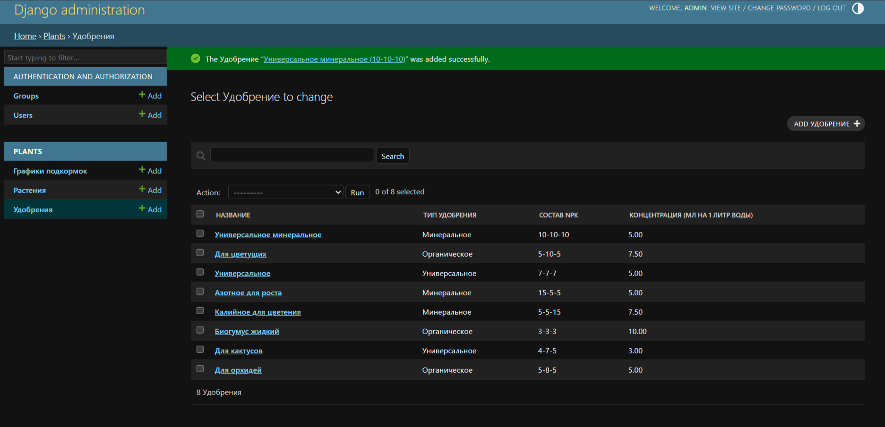

# Сервис подбора удобрений для комнатных растений

Веб-сервис помогает подобрать удобрение для комнатного растения, рассчитать точную дозировку и получить график подкормок на месяц вперёд. Сервис автоматически рекомендует удобрение в зависимости от фазы роста растения (рост, цветение, покой).

**Ссылка на рабочий проект:** [ekaterina13.pythonanywhere.com](https://ekaterina13.pythonanywhere.com)

## Стек технологий
- **Backend:** Django, Python 3.13
- **Frontend:** HTML5, Bootstrap 5
- **Визуализация:** Plotly (столбчатые диаграммы)
- **Обработка данных:** Pandas
- **База данных:** SQLite (локально), MySQL (на PythonAnywhere)
- **Деплой:** PythonAnywhere

## Как это работает
1. Пользователь открывает каталог растений на главной странице
2. Находит нужное растение через поиск (без учёта регистра)
3. Нажимает на растение и переходит на страницу подбора удобрения
4. Видит рекомендуемое удобрение (автоподбор по фазе роста)
5. Выбирает удобрение из списка и вводит объём воды для полива
6. Нажимает «Рассчитать» и получает точную дозировку в мл
7. Система строит график подкормок на 8 шагов вперёд с нарастающей дозировкой

## Скриншоты

### Главная страница с каталогом растений


### Страница растения с формой и графиком подкормок


### Панель администратора


## Установка и локальный запуск

1. Клонируйте репозиторий:

 ```bash
   git clone https://github.com/Ekaterina1347/plant-feeding-helper.git
   cd plant-feeding-helper 
   ```
   
2. Создайте и активируйте виртуальное окружение:

 ```bash
python -m venv venv
source venv/bin/activate # Windows: venv\Scripts\activate
```

3. Установите зависимости:

```bash
pip install -r requirements.txt
```

4. Выполните миграции:

```bash
python manage.py migrate
```

5. Создайте суперпользователя:

```bash
python manage.py createsuperuser
```

6. Запустите сервер:

```bash
python manage.py runserver
```


7. Откройте сайт:

```bash
http://127.0.0.1:8000
```

8. Для входа в админку: 

```bash
http://127.0.0.1:8000/admin
```

## Ссылка на работающий сайт
**[ekaterina13.pythonanywhere.com](https://ekaterina13.pythonanywhere.com)**